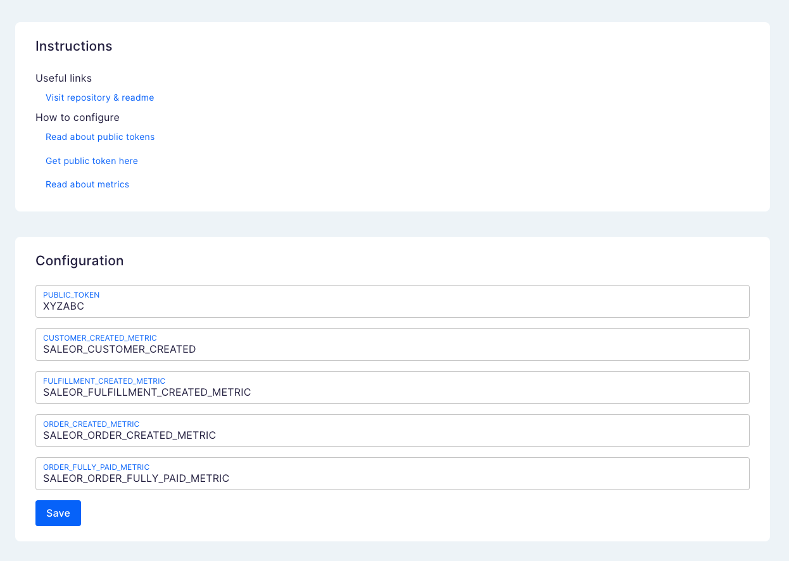

# Saleor App Klaviyo

Simple Klaviyo example app for Saleor



### What's included?

- 🧩 Connection between Saleor and Klaviyo
- 🏆 4 built-in, example webhooks, that trigger Klaviyo metrics
- 🎨 Add new webhooks with ease

### The stack

Klaviyo app is based on App Template - you can check it [here](https://github.com/saleor/saleor-app-template)

## How to use this project

### Requirements

- [node v16](http://nodejs.com)
- [pnpm](https://pnpm.io/)
- Saleor Cloud account (free!) or local instance
- [Saleor CLI](https://docs.saleor.io/docs/3.x/developer/cli)

### Saleor CLI for the win 🚀

[Saleor CLI](https://github.com/saleor/saleor-cli) is designed to save you from the repetitive chores around Saleor development, including creating Apps. It will take the burden of spawning new apps locally, connecting them with Saleor environments, and establishing a tunnel for local development in seconds.

[Full Saleor CLI reference](https://docs.saleor.io/docs/3.x/developer/cli)

### Local development

1. Make sure you have installed required tools
2. Clone repository
3. Install app dependencies with `pnpm i`
4. Start dev server `pnpm dev`
5. To install app in your Saleor Instance and expose dev server to it, run in the separate terminal `saleor app tunnel`
6. Now you can access the app configuration at [your dashboard]/apps and click on [klavio]
7. Read how to connect the app with the Klaviyo [here](https://github.com/saleor/saleor-app-template)

### Local development without CLI

Add URL of your Saleor instance to the `.env` file:

```
NEXT_PUBLIC_SALEOR_HOST_URL=https://your-saleor-instance.com
```

Install dependencies `pnpm install`

Start local server `pnpm run dev`

Follow the guide [how install your app](https://docs.saleor.io/docs/3.x/developer/extending/apps/installing-apps#installation-using-graphql-api) and use tunneling tools like [localtunnel](https://github.com/localtunnel/localtunnel) or [ngrok](https://ngrok.com/) in order to expose your local server.

If you use [saleor-dashboard](https://github.com/saleor/saleor-dashboard) and your local server is exposed, you can install your app by following this link:

```
[YOUR_SALEOR_DASHBOARD_URL]/apps/install?manifestUrl=[YOUR_APPS_MANIFEST_URL]
```

### Generated schema and typings

Commands `build` and `dev` would generate schema and typed functions using Saleor's GraphQL endpoint. Commit `generated` folder to your repo as they are necessary for queries and keeping track of the schema changes.

[Learn more](https://www.graphql-code-generator.com/) about GraphQL code generation.

### Storing registration data - APL

During registration process Saleor API pass the auth token to the app. With this token App can query Saleor API with privileged access (depending on requested permissions during the installation).
To store this data, app-template use a different [APL interfaces](https://github.com/saleor/saleor-app-sdk/blob/main/docs/apl.md).

The choice of the APL is done using `APL` environment variable. If value is not set, FileAPL is used. Available choices:

- `file`: no additional setup is required. Good choice for local development. Can't be used for multi tenant-apps or be deployed (not intended for production)
- `upstash`: use [Upstash](https://upstash.com/) Redis as storage method. Free account required. Can be used for development and production and supports multi-tenancy. Requires `UPSTASH_URL` and `UPSTASH_TOKEN` environment variables to be set

If you want to use your own database, you can implement your own APL. [Check the documentation to read more.](https://github.com/saleor/saleor-app-sdk/blob/main/docs/apl.md)

### Learn more about Saleor Apps

[Apps guide](https://docs.saleor.io/docs/3.x/developer/extending/apps/key-concepts)

[Configuring apps in dashboard](https://docs.saleor.io/docs/3.x/dashboard/apps)
